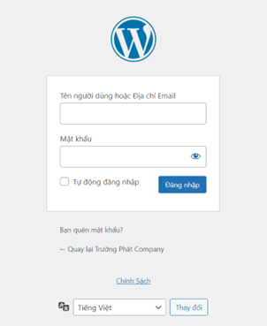
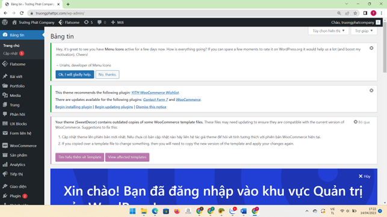
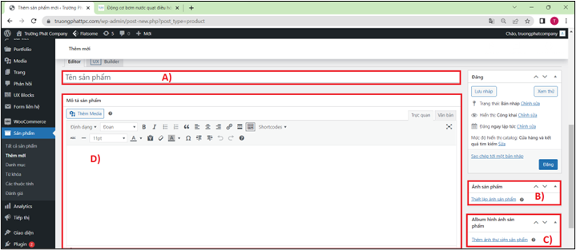
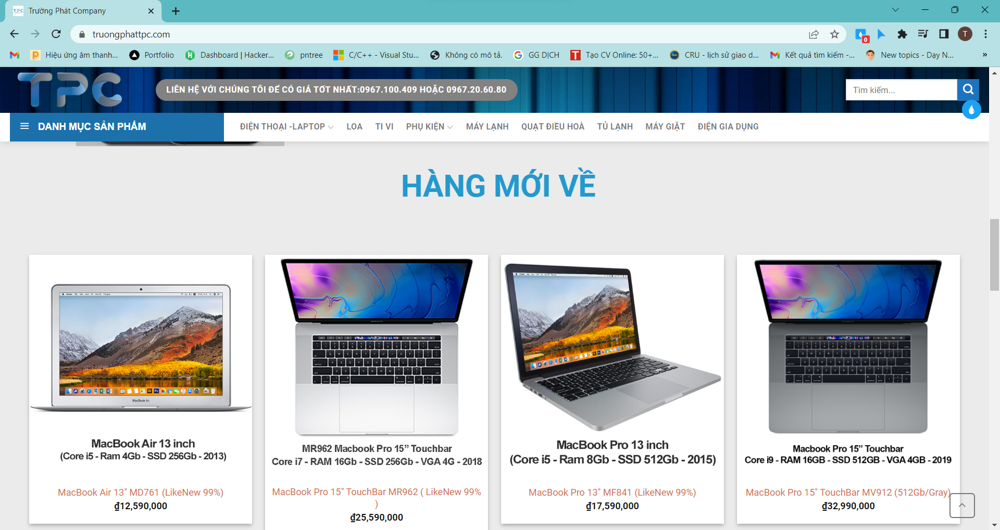

### WELCOME TO WORDPRESS SHOP 👋👋👋
 
<h3>Introduction</h3> 

Here is introduction page for real project that I built for my customer. By using Wordpress combine with theme Flatsome and WooCommerce. This is Truong Phat Company operation system management app. To view more about shop, please go to <a href="http://truongphattpc.com/" target="_blank">truongphattpc.com</a>

Talking about performance, My wordpress shop can perform ecommerce web's basic actions like view, search by name or type, order. Besides, it also can redirect product on page to product on Shopee when user click 'Mua hàng tại Shopee' button.

<h3>CMS system</h3>
 

  
  
  
  

<i>Sample results</i>
 

<h3>User Interface</h3>
 

  
  

<i>Sample results</i>
 

<h3>Motivation</h3>
I was introduced by b brother in profession to a client who was in need of website design. And fortunately, before that, I researched and designed a personal website for myself at local. So, I just learn more, understand what's thing customer need, consult and deploy it.

Finally, when I hand over the product for my customer, they very satisfied about website, I funny that thing. Therefore, I know this project still very basic. I need learn very much to improve my professional skills.

<h3>How to use my code</h3>
With my project, you must access to project folder. In this folder, it contains file 'backup.wpress' and file 'database.sql'.

Firstly, please install 'XAMPP' app. This is  one of the widely used cross-platform web server, which helps you create and test your program on a local webserver. You need import file 'database.sql' to XAMPP system.
Tutorial: <a href="https://www.cs.virginia.edu/~up3f/cs4750/supplement/DB-setup-xampp.html" target="_blank">Import database to XAMPP system</a>

Secondly, You need download Wordpress zip in <a href="https://vi.wordpress.org/download/">here.</a> and install plugin 'All in one migration" after complete set up Wordpress page. When you're done installing plugin, you need import file 'backup.wpress' to Wordpress by <a href="https://tailieu.hostingviet.vn/huong-dan-backup-va-restore-plugins-all-in-one-wp-migration/" target="_blank">this tutorial.</a> 
